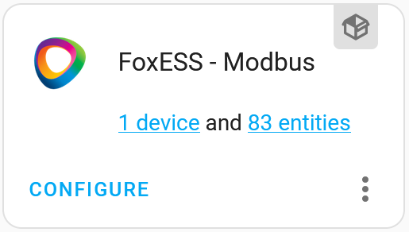
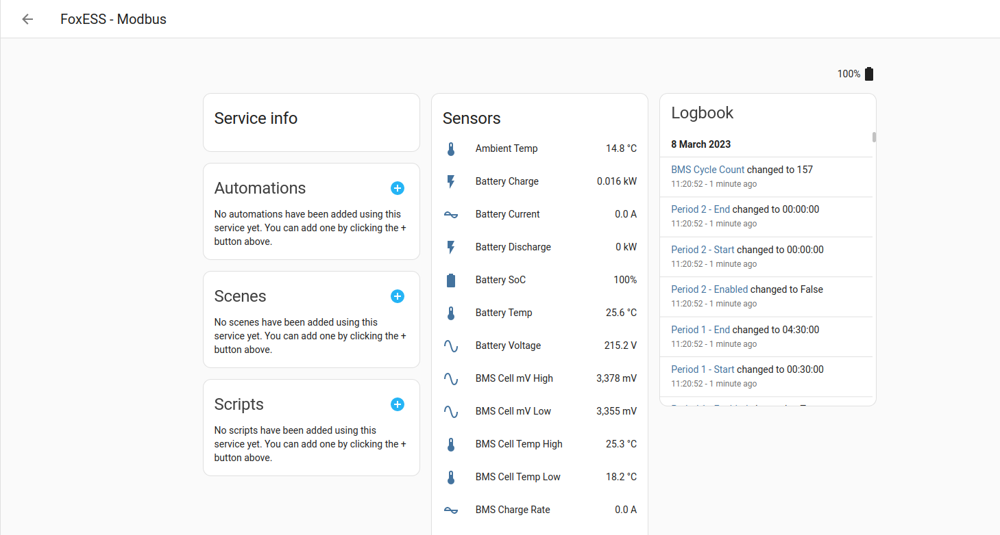

# FoxESS - Modbus

[![GitHub Release][releases-shield]][releases]

\*\* **This project is not endorsed by, directly affiliated with, maintained, authorized, or sponsored by FoxESS** \*\*

## Introduction

This project is based on repository of "nathanmarlor", see https://github.com/nathanmarlor/foxess_modbus.
I made it compatible with my Foxess inverter P3-Smart what is fully compatible with H3-Smart.
A Home Assistant custom component which communicates with FoxESS H-series inverters and derivatives without using FoxESS's cloud.

This means that you're not reliant on FoxESS's cloud infrastructure, so HA keeps working when the cloud goes down.
You can also read solar production etc in real-time, rather than once every 5 minutes.

Depending on your inverter model, you can also set charge periods, work mode, min/max SoC.
See [Supported Features](https://github.com/nathanmarlor/foxess_modbus/wiki/Supported-Features).

Supported models:

- FoxESS H1 (including AC1, AIO-H1 and G2)
- FoxESS H3 (including AC3 and AOI-H3)
- FoxESS H3 PRO
- FoxESS H3-Smart
- FoxESS P3-Smart
- FoxESS KH
- Kuara H3
- Sonnenkraft SK-HWR
- STAR
- Solavita SP
- a-TroniX AX
- Enpal
- 1KOMMA5°

You will need a direct connection to your inverter.
In most cases, this means buying a modbus to ethernet/USB adapter and wiring this to a port on your inverter.
See the documentation for details.

**[See the wiki](https://github.com/nathanmarlor/foxess_modbus/wiki) for how-to articles and FAQs.**

## Installation

Recommended installation is through HACS: as custom repository.

1. Navigate to HACS integration and:
2. Click on the 3 dots in the top right corner.
3. Select "Custom repositories"
4. Add the URL to the repository.
5. Select the correct type.
6. Click the "ADD" button.
7. Restart Home Assistant
8. Go to Settings > Devices and Services > Add Integration
9. Search for and select 'FoxESS - Modbus' (If the integration is not found, empty your browser cache and reload the page)
10. Proceed with the configuration

## Usage

1. Navigate to Settings -> Devices & Services to find:

2. Select '1 device' to find all Modbus readings:

---
[releases-shield]: https://img.shields.io/github/release/spiderjuka/foxess_modbus_custom.svg?style=for-the-badge
[releases]: https://github.com/spiderjuka/foxess_modbus_custom/releases
